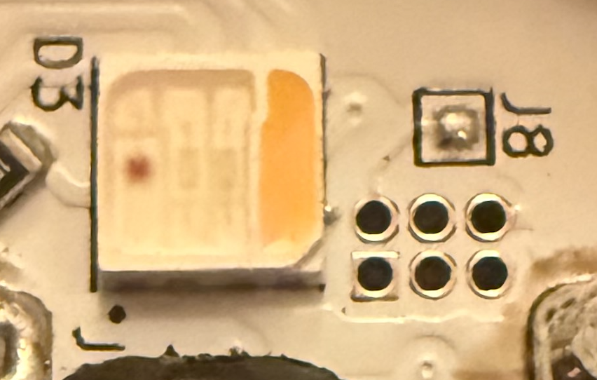

# Electrical connections
## Velaflame Header

To upload new firmware the velaflame (pcb "rev k"), first remove the top of the candle (clear cover and white cover both just pop off with a bit of sideways pressure), and expose the 1.27mm pitch 2x3 header holes, as shown in the picture.

The electrical connections are connected to the microcontroller as follows:
|3v3|IO5|GND|
|---|---|---|
|IO9|RXD0|TXD0|

(The square pin is IO9)

You may notice that IO5 is present instead of EN. Unfortunately EN is not exposed, so we will need to power cycle the device manually.

## Programmer connections
Connect the pins to the matching pins on your programmer. For the ESP-PROG-2 (what I used) you connect TX->TX. For many others, you might need to swap them. Because there is no enable line, we will need to manually power cycle the board, and therefore will not connect the 3v3 line from our programmer. This is what my connections looked like:
|nc|nc|GND|
|---|---|---|
|IO0|RXD0|TXD0|

Note that the ESP32-C3-mini-1 on the velaflame uses IO9 instead of IO0 (used by most ESP32s) to enter the bootloader. You do want to use IO9, so dont be concerned if the programmer data sheet references IO0.

I used a set of 1.27mm pogo pins that I purchased to simplify the connection, but you can connect however is easiest for you.

## Programming sequence
Because we dont have the enable pin exposed, we need to manually put the device into bootloader mode. To accomplish this, we need to pull IO9 low as we power on the device. If you are using an ESP-PROG-2, you can accomplish that by holding down the "BOOT TARGET" button on the edge of the PCB (not the one in the middle of the PCB labeled "BOOT" in smaller text).

The steps are:
- Connect programmer to velaflame, using the 4 connections described above.
- Connect programmer to computer
- prepare command to upload firmware but do not execute it (see the Programming section below)
- Hold down the "BOOT TARGET" button on the programmer
- Connect the velaflame to power (such as turning on the socket)
- Release the "BOOT TARGET" button
- Trigger the program command that you prepared
- Wait while the firmare is uploaded to your velaflame.

# Programming
## Generate the firmware
In my case, I wanted to add the velaflame as an ESPHome device, and to connect it to my existing Home Assistant setup that was already configured through the `ESPHome Builder` addon.

To create the new firmware file,
- Make sure you have Home Assistant set up, with ESPHome Builder installed
- Go to the ESPHome Builder page
- Hit "New Device"
- "New Device Setup"
- Enter your name
- Skip installation
- Select "ESP32-C3"
- Click "Install" (you dont need to save the key, it is included in your config file)
- Hit "Manual Download"
- (wait for it to compile)
- Hit "Download" (NOT "Download logs". The download box might also pop up automatically)
- Choose the "Factory Format (Previously Modern)" format
- Remember where your programming file was saved. Probably in your downloads folder.

Note that this will give you a very bare-bones ESPHome device firmware. You will be able to wirelessly upload your full firmware through the ESPHome Builder UI later.

## Flashing tools setup
I used `esptool.py` to upload the new firmware to the velaflame. If you don't already have it installed, on Linux or a Mac you can install it with

`pip3 install esptool`

If you are using an ESP-PROG-2 programmer, you can find your port by running

`ls /dev/cu.usbmodem*`

If you get multiple results, see which one disappears when you disconnect the programmer from your computer.

## Actual programming command
On my mac, using an ESP-PROG-2 programmer, the actual command to flash the velaflame was:

`esptool.py --chip esp32c3 --port /dev/cu.usbmodem[YOUR_PORT_ID] write_flash 0x0 ~/Downloads/[your_file].factory.bin`

Your command is probably similar, but depending on your system may be different in ways that are outside of the scope of this guide.